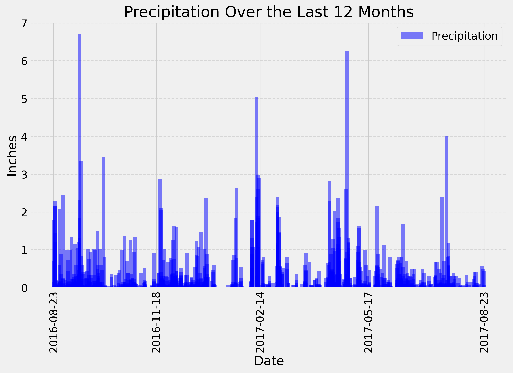

# Climate Analysis API 🌦️

## 📌 Project Overview
This Flask API provides climate data analysis for Honolulu, Hawaii, using historical weather data stored in a SQLite database.  
The API allows users to retrieve **precipitation levels, station details, temperature observations**, and query min/avg/max temperatures for specific date ranges.

## 🛠️ Technologies Used
- **Python** (Flask, SQLAlchemy, Pandas)
- **SQLite** (Database)
- **Jupyter Notebook** (Exploratory Data Analysis)
- **Matplotlib** (Visualization)

---

## ⚙️ Setup Instructions

### 1️⃣ **Clone the Repository**
```bash
git clone https://github.com/BatuhanAysan/sqlalchemy-challenge.git
cd sqlalchemy-challenge/SurfsUp
```

### 2️⃣ **Set Up a Virtual Environment (Recommended)**
```bash
python -m venv venv
source venv/bin/activate   # Mac/Linux
venv\Scripts\activate      # Windows
```
### 3️⃣ **Install Dependencies**
```bash
pip install -r requirements.txt
```
### 4️⃣ **Run the Flask App**
```bash
python app.py
```
## 📊 Exploratory Data Analysis (EDA)

Before building the API, I conducted an **exploratory data analysis (EDA)** using Jupyter Notebook.  
This step helped me understand the dataset, clean the data, and extract useful insights.

📌 **Jupyter Notebook File:** [`climate_starter.ipynb`](./SurfsUp/climate_starter.ipynb)  

### 🔹 **Key Steps in EDA:**
- **Database Inspection:**  
  - Connected to the SQLite database and explored table structures.
- **Precipitation Analysis:**  
  - Queried the last 12 months of precipitation data.
  - Generated a bar chart showing precipitation trends over time.
- **Station Analysis:**  
  - Identified the most active weather station.
  - Queried temperature observations from this station.
- **Temperature Trends:**  
  - Analyzed minimum, average, and maximum temperatures.
  - Created a histogram of temperature distribution.

### 📊 **Example Visualization from Jupyter Notebook**
Below is an example **precipitation trend** visualization created in Jupyter Notebook:



## 🌍 Available API Routes

### 🔹 Homepage
- **`/`** - Lists all available API endpoints.

### 🔹 Precipitation Data
- **`/api/v1.0/precipitation`**  
  - Returns the last 12 months of precipitation data.  
  - 📌 **Example:** [`/api/v1.0/precipitation`](http://127.0.0.1:5000/api/v1.0/precipitation)

### 🔹 Weather Stations
- **`/api/v1.0/stations`**  
  - Returns a list of all weather stations.  
  - 📌 **Example:** [`/api/v1.0/stations`](http://127.0.0.1:5000/api/v1.0/stations)

### 🔹 Temperature Observations
- **`/api/v1.0/tobs`**  
  - Returns the last 12 months of temperature observations from the most active station.  
  - 📌 **Example:** [`/api/v1.0/tobs`](http://127.0.0.1:5000/api/v1.0/tobs)

### 🔹 Temperature Summary for a Start Date
- **`/api/v1.0/<start>`**  
  - Returns min, avg, and max temperature for all dates **greater than or equal** to the start date.  
  - 📌 **Example:** [`/api/v1.0/2017-01-01`](http://127.0.0.1:5000/api/v1.0/2017-01-01)

### 🔹 Temperature Summary for a Date Range
- **`/api/v1.0/<start>/<end>`**  
  - Returns min, avg, and max temperature for all dates **between the start and end date (inclusive).**  
  - 📌 **Example:** [`/api/v1.0/2017-01-01/2017-08-23`](http://127.0.0.1:5000/api/v1.0/2017-01-01/2017-08-23)

## 📊 Example API Responses
✅ `/api/v1.0/precipitation`
```json
{
    "2017-08-23": 0.45,
    "2017-08-22": 0.5,
    "2017-08-21": 0.56
}
```
✅ `/api/v1.0/stations`
```json
[
    "USC00519397",
    "USC00513117",
    "USC00514830"
]
```
✅ `/api/v1.0/tobs`
```json
[
    77, 77, 80, 80, 75, 73, 78
]
```
✅ `/api/v1.0/2017-01-01`
```json
{
    "TAVG": 74.143,
    "TMAX": 87.0,
    "TMIN": 58.0
    
}
```
## 🔍 Additional Notes
- Dates must be in **`YYYY-MM-DD`** format.
- Ensure the **`Resources/hawaii.sqlite`** file is present in the project directory.
- This project is for educational purposes (**University of Toronto Data Analytics Bootcamp**).

---

## 📩 Author & Contact
📌 **Developed by:** *Batuhan Aysan*  
📌 **GitHub:** [My GitHub](https://github.com/BatuhanAysan)  
📌 **LinkedIn:** [My LinkedIn](https://linkedin.com/in/batuhan-aysan-970894139/)  

